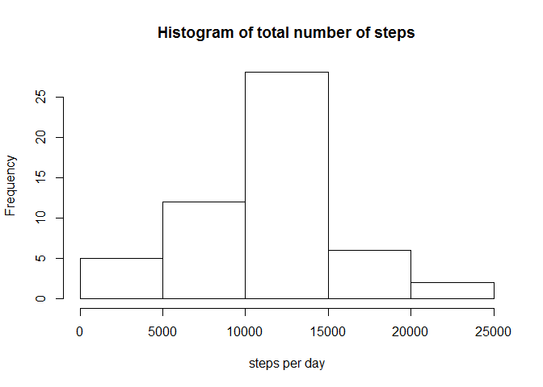
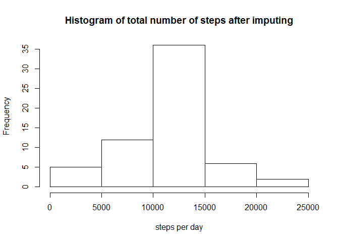

# Reproducible Research: Peer Assessment 1

##Loading and preprocessing the data


```r
activity <- read.csv(unz("activity.zip","activity.csv"))
```


##What is mean total number of steps taken per day


```r
dailystep <- aggregate(steps ~ date, data = activity, FUN = sum, na.rm = TRUE)
hist(dailystep$steps,main = "Histogram of total number of steps", xlab = "steps per day")
```

<!-- -->


**The mean and Mdian of the total number of steps taken per day:** 

```r
summary(dailystep)[,2][3:4]
```

```
##                                     
## "Median :10765  " "Mean   :10766  "
```


##What is the average daily activity pattern?


```r
avgInterval <- aggregate(steps~interval,data = activity, FUN = mean,na.rm = TRUE)
plot(avgInterval,type = "l")
```

<!-- -->

**which 5-minute interval, on average accross all the days in the dataset,contains the maximum number of steps:**


```r
library(dplyr)
```

```r
arrange(avgInterval,desc(steps))[1,]
```

```
##   interval    steps
## 1      835 206.1698
```


##Imputing missing values

**Calculate and report the total number of missing values in the dataset**

```r
sum(!complete.cases(activity$steps))
```

```
## [1] 2304
```
**Devise a strategy for filling in all of the missing values in the dataset**

Step 1: find out which columns have missing values

```r
sum(is.na(activity$steps))
```

```
## [1] 2304
```

```r
sum(is.na(activity$date))
```

```
## [1] 0
```

```r
sum(is.na(activity$interval))
```

```
## [1] 0
```
We can see only activity$steps has missing values.

Step 2: Devise a strategy for filling in all of the missing values in the dataset. 
Here my strategy is to use the mean for that 5-minute interval

Step 3: Create a new dataset activity_imp with missing data filled in

```r
activity_imp <- activity %>% 
                group_by(interval) %>%
                mutate(steps= replace(steps, is.na(steps), mean(steps, na.rm=TRUE)))
```

Step 4: Make a histogram of the toal number of steps taken each day

```r
dailystepImp <- aggregate(steps ~ date, data = activity_imp, FUN = sum, na.rm = TRUE)
hist(dailystepImp$steps,main = "Histogram of total number of steps after imputing", xlab = "steps per day")
```

<!-- -->

**Mean and median total number of steps taken per day:**

```r
summary(dailystepImp)[,2][3:4]
```

```
##                                     
## "Median :10766  " "Mean   :10766  "
```
We can see the impact of imputing missing data on the estimates of the total daily number of steps is not significant. 

##Are there differences in activity patterns between weekdays and weekends?

**Create a new factor variable in the dataset with two levels -- "weekday" and "weekend"**

```r
activity_imp$date <- as.Date(activity_imp$date)
weekdays1 <- c('Monday', 'Tuesday', 'Wednesday', 'Thursday', 'Friday')
activity_imp$wDay <- factor((weekdays(activity_imp$date) %in% weekdays1), levels=c(FALSE, TRUE), labels=c('weekend', 'weekday') )
```
**Make a panel plot**

```r
library(lattice)
```

```r
avgstep <- aggregate(steps ~ wDay + interval,data = activity_imp,FUN = mean)
xyplot(steps ~ interval | wDay,data = avgstep, type = 'l',layout = c(1,2))
```

<!-- -->
